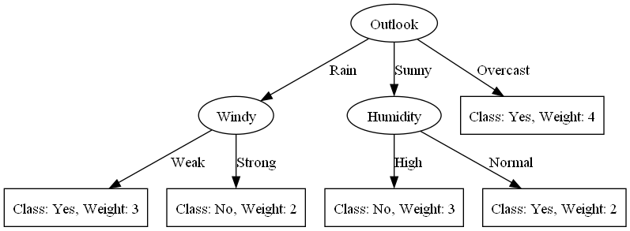

# C4.5 Decision Tree Classifier
## Introduction
### What is C4.5?
C4.5 is an algorithm used to generate a decision tree developed by Ross Quinlan. C4.5 is an extension of Quinlan's earlier ID3 algorithm. The decision trees generated by C4.5 can be used for classification, and for this reason, C4.5 is often referred to as a statistical classifier. C4.5 builds decision trees from a set of training data in the same way as ID3, using the concept of information entropy. The training data is a set S = {s1, s2, s3, ... , sn} of already classified samples. Each sample si consists of a tuple (xi, ci) where xi is a vector of attributes and ci is the class. The algorithm recursively splits the set S into subsets Si using an attribute ai that maximizes the information gain (or minimizes the information entropy) of the resulting subsets. The splitting procedure stops when the algorithm has reached a predefined termination criterion, such as when all samples in the resulting subset Si belong to the same class, or when all attributes in the resulting subset Si have the same values. The resulting tree is then used to classify new unseen samples x by traversing the tree from root to leaf and assigning the class of the leaf to the sample.

### Top attributes
In this library, for top attribute use gain ratio instead of information gain. Gain ratio is a modification of information gain that reduces its bias for attributes with a large number of distinct values. Gain ratio is defined as:
```
GainRatio(S, A) = Gain(S, A) / SplitInfo(S, A)
```
where
```
SplitInfo(S, A) = - sum ( |Sv| / |S| ) * log2 ( |Sv| / |S| )
```
and Sv is the subset of S for which attribute A has value v.

## Requirements
- Python 3.6 or above
- Pandas
- Numpy

## Implementation

### Installation
```
pip install c45-decision-tree
```

### Train Model
For training model, you need to prepare data in pandas dataframe format. For train model you need to can call `fit` method with 2 parameters, first is data and second is target. For example:
```python
from C45 import C45Classifier
import pandas as pd

data = pd.read_csv('data.csv')
X = data.drop(['target'], axis=1)
y = data['target']

model = C45Classifier()
model.fit(X, y)
```

### Predict
For predict data, you can call `predict` method with 1 parameter, first is data. For example:
```python
data_test = pd.read_csv('data_test.csv')
model.predict(data_test)
```

### Evaluate
For evaluate model, you can call `evaluate` method with 2 parameters, first is data and second is target. For example:
```python
data_test = pd.read_csv('data_test.csv')
X_test = data_test.drop(['target'], axis=1)
y_test = data_test['target']
model.evaluate(X_test, y_test)
```

### Summary Model
For summary model, you can call `summary` method. For example:
```python
model.summary()
```

### Save and Load Model
For save you can use pickle library. For example:
```python
import pickle

with open('model.pkl', 'wb') as f:
    pickle.dump(model, f)

model = pickle.load(open('model.pkl', 'rb'))
```

### Draw Tree
For draw tree use library graphviz and must be installed in your computer. For example:
```python
import graphviz
model.generate_tree_diagram(graphviz,"File Name")
```
Example output:


### Write Rules
For write rules, you can call `write_rules` method. For example:
```python
model.write_rules()
```


